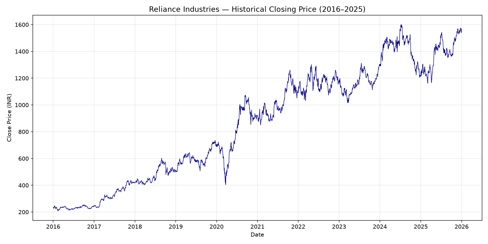
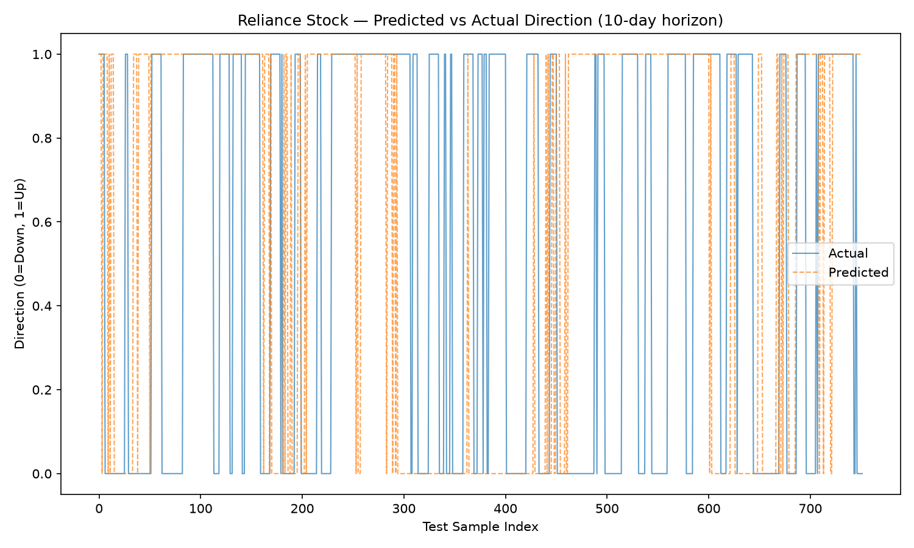
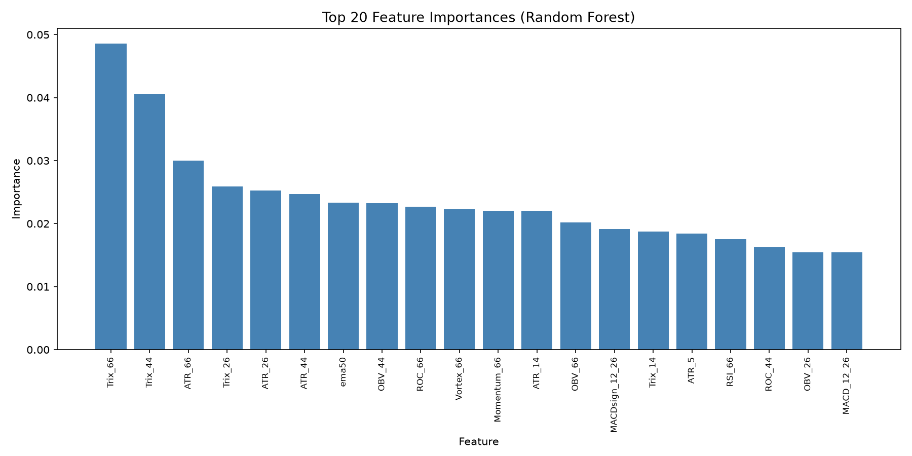

<div align="center">

# Reliance Industries Stock Direction Prediction


</div>

> This project aims to predict the future price direction of **Reliance Industries (NSE: RELIANCE)** stock using Machine Learning. Specifically, it uses a Random Forest classifier to predict whether the stock's closing price will go up or down over a 10-day horizon based on historical price data and technical indicators.

---

## Dataset

| Detail | Value |
| --- | --- |
| **File** | `RELIANCE_historical_final_data.csv` |
| **Period** | January 2016 – December 2025 (~2,471 trading days) |
| **Columns** | Date, Adj Close, Close, High, Low, Open, Volume |
| **Source** | Historical stock data for Reliance Industries Limited |

---

## How It Works

1. **Data Smoothing** — The raw stock data is smoothed using an exponential weighted moving average to reduce daily market noise and highlight underlying trends.
2. **Feature Engineering** — Over 60 technical indicators are calculated from the stock data to help the model find patterns. These include:
	 - Relative Strength Index (RSI)
	 - Stochastic Oscillator
	 - Average True Range (ATR)
	 - MACD (Moving Average Convergence Divergence)
	 - Momentum and Volume indicators
3. **Training the Model** — A Random Forest Machine Learning model is trained on the first two-thirds of the chronological data. It learns how the technical indicators relate to future price movements.
4. **Evaluation** — The model is then tested on the remaining one-third of the unseen data to evaluate its accuracy in predicting whether the price will be higher or lower 10 days out.

---

## How to Run

```bash
# Make sure you have the required packages installed
pip install pandas numpy scikit-learn matplotlib

# Run the prediction script
python RELIANCE_stock_prediction.py
```

Running the script will train the model, print the evaluation metrics (Accuracy, Precision, Recall, F1 Score), and generate visualization plots.

---

## Visualization Plots

<div align="center">

<strong>1. Historical Closing Price</strong>



<strong>2. Predicted vs Actual Direction</strong>



<strong>3. Feature Importances</strong>



</div>

---

## Project Files

| File | Description |
| --- | --- |
| `RELIANCE_stock_prediction.py` | Main prediction script |
| `RELIANCE_historical_final_data.csv` | Reliance Industries historical stock data |
| `pandas_techinal_indicators.py` | Technical indicators library |
| `README.md` | This documentation file |
